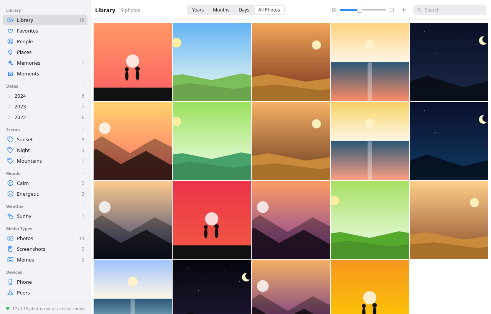
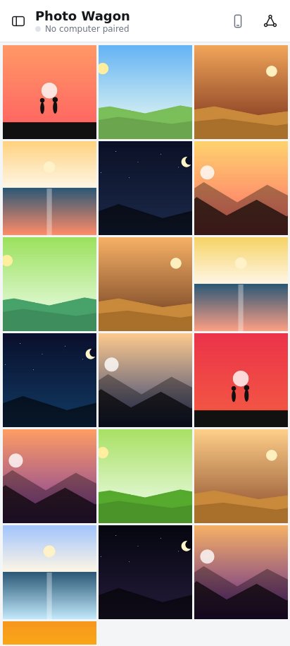

> _"…we all got a chicken duck woman thing waiting for us."_

<p align="center">
  
</p>

<div align="center">
  
  <h1>Photo Wagon</h1>
</div>

**A local-first photo manager written in D** — a Qt Quick desktop app, an indexer,
and a libp2p node for sharing albums directly between your machines, all in one
program.

Everything runs on your computer. Nothing is uploaded anywhere unless you choose
to share an album with a peer.

> 🎵 *"I've got her picture on my photo-wagon, and she probably love to honky tonk…"*
> — Bad Lip Reading, **"Bushes of Love"** — where the name comes from.

---

## Highlights

- **Photos-style desktop** — a years → months → days timeline, a fast grid, and a full viewer.
- **Faces & people** — on-device detection and clustering (YuNet + SFace); name a face once.
- **Places** — offline GPS → city (compiled-in GeoNames), or set a place by hand.
- **Scenes, moods, weather & holidays** — zero-shot CLIP tags, fully offline.
- **Tags that live in the files** — written to XMP/IPTC, so they travel with the photo.
- **Non-destructive editing** — filters, adjustments, crop; the original is never touched.
- **Similar photos** — nearest-neighbour over CLIP embeddings, stored in sqlite-vec.
- **Peer-to-peer sharing** — sync with your phone and other machines over libp2p, no cloud.

---

## Screenshots

<p align="center">
  
</p>
<p align="center"><sub>The desktop library — the years → months → days timeline, scene / mood / weather tags, and the grid.</sub></p>

<p align="center">
  
</p>
<p align="center"><sub>On the phone — a libp2p peer of your computer.<br><i>(all photos shown are procedurally-generated placeholders)</i></sub></p>

---

## The desktop app

### Dates
Taken-time comes from EXIF first; then the file name or folder (WhatsApp,
screenshots, camera and Pixel names, `2020/02/13/` folders); and only then the
file's modification time.

### Browsing
- **Sidebar** — Library, Favorites, People, Places, Imports; the **years → months → days**
  tree with counts (one click jumps to a day, the same node again clears it); Media
  Types (Photos, Screenshots, Memes); your albums; the phone and peers; a
  connection / indexing status line in the footer.
- **Toolbar** — Years / Months / Days / All Photos, a zoom slider, and search.
- **Grid** — click selects, ⌘/Ctrl-click extends, double-click opens, hover shows the
  heart (and the scene / holiday / weather).
- The Library timeline shows photographs; screenshots and memes live under Media
  Types (an album or a search shows everything).

### The viewer
Opens in place of the grid, with a caption line (date, camera, size, file), a
filmstrip, and an **ⓘ Info** panel.

- **Zoom** — wheel, double-click, `+` / `−` / `0`, or drag. **Full screen** — `F`.
- **Right-click a photo or selection** — copy files, copy paths, show in folder,
  favorite, add to an album, set the place, mark as photo / screenshot / meme,
  move to trash, delete permanently (`Delete` and `Shift+Delete` from the keyboard).

### People & faces
On-device face detection and clustering (YuNet + SFace, via one C++ shim).

- The **ⓘ Info** panel lists the people in a photo with round portraits, and "Name"
  for the unnamed ones.
- Naming a face lists the likely people first, then everyone alphabetically with
  portraits, narrowed as you type (↑/↓ and Return pick one).
- "Use as portrait" makes that face the person's picture; right-clicking a face
  can change or rename the person, use it as the portrait, remove the tag, or mark
  it as not a face.
- A **People** page shows everyone with round portraits.

### Places
- A **Places** page: one card per city with its newest photo and count; the cities
  appear in the sidebar too.
- A photo with GPS lands in the nearest city — a compiled-in **GeoNames** table,
  fully offline (a `0,0` position from a phone with location off counts as none).
- Set the rest by hand: select → right-click → **Set Place…**, which suggests your
  own places first, then the world's cities as you type, or keeps any name you enter.

### Scenes, moods, weather & holidays
Every photograph is tagged offline by **CLIP** (ViT-B/32, zero-shot):

| Axis | Examples |
|---|---|
| **Scene** | Beach, Pool, Snow, Mountains, Party, Birthday, Food, Pets, Baby, Selfie, Night… |
| **Mood** | Joyful, Calm, Romantic, Energetic, Nostalgic, Cozy, Festive, Melancholic… |
| **Weather** | Sunny, Cloudy, Rainy, Stormy, Foggy, Snowy, Hot, Cold |
| **Holiday** | Christmas, New Year, Carnival, Easter, Halloween, Festa Junina, Mother's / Father's / Children's / Valentine's Day (from the calendar, Brazilian dates); Birthday, Wedding, Graduation (from the picture) |

Each is a sidebar section with counts, a row in the ⓘ Info panel (with the model's
top guesses), and a right-click submenu to correct it. The vocabulary lives in
`data/scenes/labels.tsv`.

### Tags
- A **tag strip** under every open photo shows its chips — scene, mood, weather,
  holiday, place, and your own tags (**+ Tag**, any words, comma-separated; × removes
  one). Clicking a chip shows every photo that shares it.
- Your tags are a sidebar section too, and **Add Tags…** (menu or toolbar) applies
  them to a whole selection.
- **Tags live in the files.** Your keywords, the scene / mood / weather / holiday,
  and the place are written into the XMP and IPTC keyword fields (`praia 2020`,
  `Scene: Beach`, `Place: Peruíbe, Brazil`) — automatically after you change a photo,
  and on request for the rest (**Write Tags to Files**). Pixels and modification
  times are left untouched, and a file that arrives with keywords brings them into
  the library.

### Editing
The sliders icon, or `E`:

- Twelve Instagram-style **filters**, previewed on the photo itself.
- **Adjustments** — brightness, contrast, saturation, warmth, fade, vignette,
  sharpen, sepia — plus rotate, flip, and a crop frame with draggable corners and
  aspect presets.
- Rendered by the core (**libvips**); the original file is never written to.
  **Save** keeps the result in the library (thumbnail and viewer follow; **Revert**
  undoes it); **Save as Copy** writes a JPEG next to the original.

### Similar photos
A chip under every photo lists the ones that look like it — a nearest-neighbour
query over the CLIP embeddings. Those, like the face clusters' centroids, live in
[sqlite-vec](https://github.com/asg017/sqlite-vec) tables inside the library
database (compiled in, `csrc/sqlite-vec.c`), never in memory.

Light or dark follows the system theme.

---

## Requirements

- `ldc2` (1.42+) or `dmd`, and `dub`
- Qt 6.11 with the DSide binding built at `../qt-dlang-gen`
  (`generated/qt-6.11/cxx-quick` + `.build/qt-6.11-cxx-quick/libbinding_ldc2.a`)
- `libp2p-dlang` checked out at `../libp2p-dlang` (and its sibling `d-webrtc-v3`)
- System libraries: `sqlite3`, `gexiv2`, `vips`, `libsodium`, `openssl`, `c-ares`,
  `qrencode`, and OpenCV 5 (`opencv5.pc`; only for the face scan — see `csrc/`)
- The face models in `models/` — `face_detection_yunet_2023mar.onnx` and
  `face_recognition_sface_2021dec.onnx` (from the OpenCV zoo); `--models DIR` points
  elsewhere

## Build & run

```sh
dub build --compiler=ldc2       # → ./photo-wagon
./photo-wagon                   # data in ~/.local/share/photowagon
./photo-wagon --data /tmp/lib   # ...or somewhere else
```

**Headless** (a server, a TV box, CI — no Qt binding needed):

```sh
dub build -c headless --compiler=ldc2   # → ./photo-wagon-headless, core only
./photo-wagon --headless                # the full binary can do it too
```

Headless mode speaks the protocol in `docs/ipc.md` on loopback TCP, writing its
port to `$XDG_RUNTIME_DIR/photowagon/daemon.port`:

```sh
printf '{"id":1,"method":"daemon.hello"}\n' \
  | nc 127.0.0.1 "$(cat "$XDG_RUNTIME_DIR/photowagon/daemon.port")"
```

**Desktop icon & launcher** — `sh share/install-desktop.sh` installs
`photo-wagon.desktop` and the icon under `~/.local/share` (Wayland reads the icon
from there by the app id `photo-wagon`; X11 gets it from the binary).

**Scene / mood model** — the scene and mood tags need the CLIP image encoder next
to the face models: `models/clip_vision.onnx` is `onnx/vision_model.onnx` from
[Xenova/clip-vit-base-patch32](https://huggingface.co/Xenova/clip-vit-base-patch32)
(335 MB, fp32). Without it everything else works and those two sections stay empty.
`data/scenes/make-prompts.py` regenerates the text side after you edit the vocabulary.

**Natural-language search model** — searching by meaning ("a dog on the beach") adds
the CLIP *text* tower: `models/clip_text.onnx` is `onnx/text_model.onnx` from the same
[Xenova/clip-vit-base-patch32](https://huggingface.co/Xenova/clip-vit-base-patch32)
(243 MB, fp32). Without it search still matches file names, the OCR text, tags, people
and dates — only the by-meaning results drop out. The BPE tokenizer's vocabulary and
merges are compiled in from `data/clip` (extracted from the model's `tokenizer.json`).

**OCR** — reading the text in screenshots, memes and documents uses **Tesseract**
(a system package; `por` here, add `tesseract-data-eng` for more English). No model to
fetch; if Tesseract is absent the build says so and OCR is simply off.

## Resource discipline

Background work runs on a leash (`core/jobs/scheduler.d`):

- Indexing, the media-kinds pass, faces, scenes, and the tag writer are **passes**
  that queue on one lane and run one at a time — new photos first.
- Every native operation (a decode, a model, a render) takes one of `--jobs N`
  permits (default 2) and steps aside while a request from the window or the phone
  is being answered.
- The **CLIP model** (about a gigabyte inside OpenCV) never lives in the app: a
  child process (`photo-wagon --clip-worker`) encodes for one pass and is then
  killed. Faces are detected on a reduced decode of big JPEGs; libvips keeps a 64 MB
  operation cache; each pass ends with a garbage collection that returns memory to
  the system. The viewer doesn't cache the 4096 px decodes of photos you open.
- A core started by a script should get `--exit-with-parent` — it dies with its
  parent. A **memory guard** watches resident size: above `--memory-limit` MB
  (default 1536) the process aborts itself with `SIGSEGV` on purpose, so the core
  dump shows what grew.

## Phone

`mobile/` is Photo Wagon on the phone — a libp2p peer of the computer's node (the
pairing QR carries its addresses). It:

- keeps the computer up to date by itself (a persistent queue, progress in an
  Android notification),
- shows the computer's faces and names on the phone's own photos, and names them
  back,
- shows the phone's own photos and sends them to the computer's library.

Click **Phone** on the computer, scan the QR with the app (⚙ → Scan QR code), then
**Send all** or **Send to computer** in the viewer. `mobile/build-android.sh`
builds the arm64 APK, installs it, and launches it on the attached phone;
`ANDROID.md` has the toolchain and pairing details. The same client builds for the
desktop for offscreen tests: `cd mobile && dub build -c desktop --compiler=ldc2`.

## Tests

```sh
dub test --compiler=ldc2                          # unit tests of every core module
tests/e2e.py /folder/with/nine/images             # two headless nodes: index, publish, fetch over libp2p
tests/faces.py /folder/with/the/lena+messi/set    # detection, clustering, naming, merging
QT_QPA_PLATFORM=offscreen QT_QUICK_BACKEND=software PW_SHOT=/tmp/shot.png ./photo-wagon   # UI screenshot
```

## Project layout

```
source/photowagon/core/   indexer, store, SQLite, gexiv2, vips, faces, libp2p node, IPC
source/photowagon/ui/     app, Library facade, bridge to the core thread
source/photowagon/main.d  picks UI + core thread, or headless
csrc/                     the one C++ file: OpenCV's YuNet + SFace behind a C surface
mobile/                   the phone client (D, TcpBridge), Android packaging and toolchain
qml/                      the interface; qml/mobile/ the phone layout
docs/ipc.md               the line protocol between UI and core
tests/                    unit test runner, e2e.py, faces.py
models/                   face-detection models
legacy/                   the previous C++/Qt + D prototype, kept for reference only
```

See `ARCHITECTURE.md` for how the pieces fit together and `ROADMAP.md` for status.

---

<div align="center">
<sub>🌳 Named for Bad Lip Reading's <b>"Bushes of Love"</b> — <i>"I've got her picture on my photo-wagon…"</i> — and yes, we'd hide in the bushes of love, oh, <b>49 times</b>.</sub>
</div>
