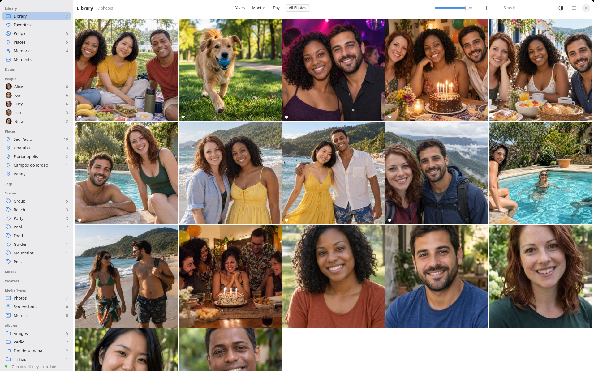
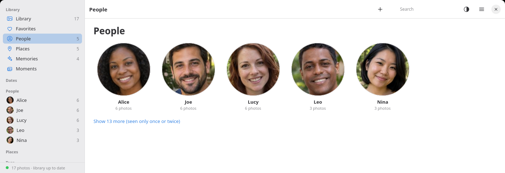
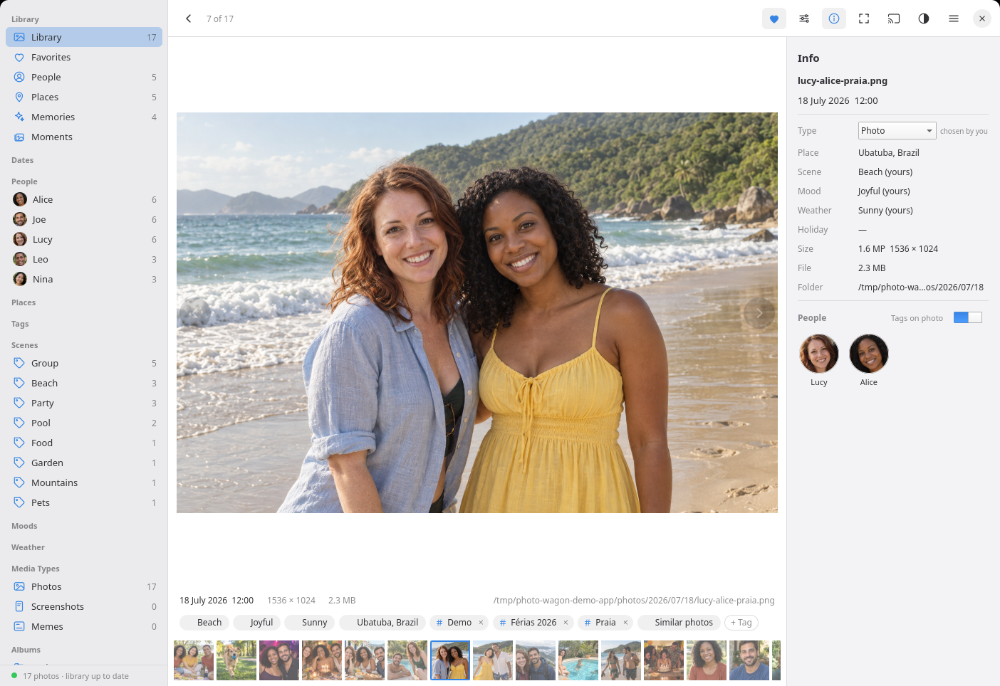
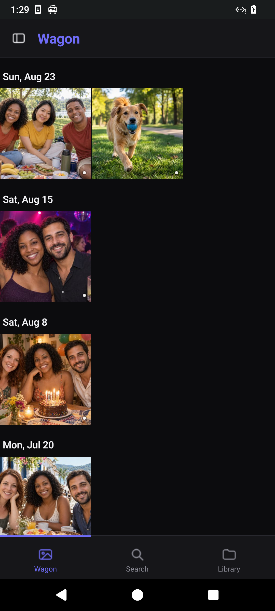
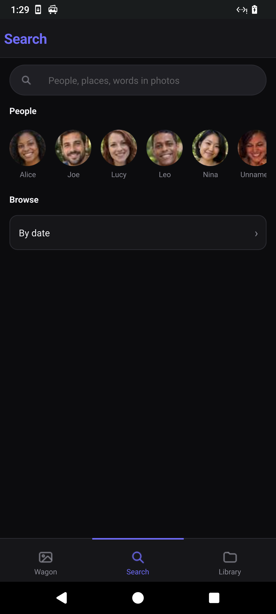
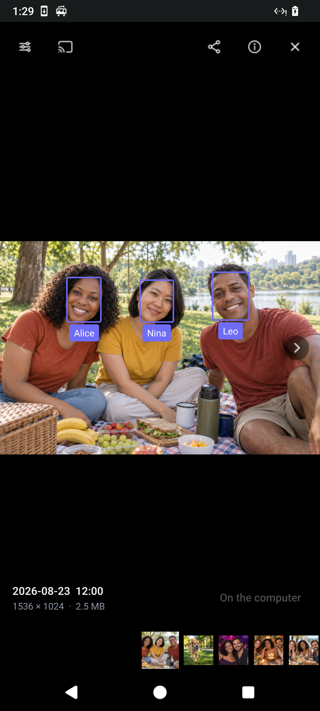

<div align="center">
  
  <h1>Photo Wagon</h1>
  <p><strong>Every photo of your life, beautifully organized — on your devices, not someone else's cloud.</strong></p>
  <p><em>“I've got her picture on my photo-wagon…”</em></p>
</div>

Somewhere in your drives there is a first birthday, a beach at sunset, a face you
miss, and twenty thousand screenshots you forgot to delete. **Photo Wagon brings
all of it back to life** — finds the people, remembers the places, surfaces the
moments — and keeps every byte where it belongs: with you.

It is a full photo library for **Linux first**, with an **Android companion**, built
to stand toe to toe with Google Photos and Apple Photos. No account. No upload. No
monthly fee for your own memories. Your computers and your phone find each other
over **peer-to-peer (Hyperswarm)** — at home, on the road, over 4G — and keep one
library in sync.

<p align="center">
  
</p>
<p align="center"><sub>The real desktop app, browsing the demo library. All people and photos are AI-generated.</sub></p>

## See it in thirty seconds

Meet Lucy, Alice, Joe, Nina, and Leo — at the beach, by the pool, blowing out
candles, out on the town, on vacation. The [demo library](docs/demo-photos/README.md)
comes with dated photos, named people, places, favorites, and albums, and it lives
in its own sandbox, far from your personal photos:

```sh
python3 tools/demo.py --open
```

(Build the app and install the face models first — see [Build and run](#build-and-run).)

## What it does for you

- **Relive your years.** A fluid, edge-to-edge grid that holds your whole library
  at once, grouped by year, month, day, and *moments*; a full-screen viewer that
  glides from photo to photo; similar shots stacked so bursts don't bury the keeper.
- **Find everyone.** On-device face recognition groups the people in your life.
  Name them once, fix a mistake with a click, pick the portrait you like.
- **Remember where.** Places from GPS, offline — and Photo Wagon learns the look of
  "home" or "grandma's" from a few photos you label.
- **Search like you think.** Type *"birthday cake at night"* and find it: semantic
  search (CLIP) runs locally, alongside people, places, dates, tags, and the text
  inside screenshots and documents (OCR).
- **Let it tidy up.** Scenes, moods, weather, and holidays suggested on-device;
  screenshots and memes gathered so you can clear them out in one go; a quarantine
  (*Remove from Wagon*) that hides a photo without touching the file.
- **Edit without fear.** Filters, light, color, warmth, crop, rotate — always
  non-destructive, always revertible, or saved as a copy.
- **Rediscover.** *On This Day*, throwbacks, and collections of people, places, and
  moments that bring old photos back when they matter.
- **Bring everything home.** Import a **Google Photos Takeout** with its real dates,
  locations, descriptions, favorites, and albums — with an import report that
  counts every item and flags what did not come through.
- **Put it on the big screen.** Cast to Chromecast or DLNA TVs, slideshows included.

The [desktop guide](docs/desktop.md) covers controls, shortcuts, metadata, and the core features in depth.

<p align="center">
  
</p>
<p align="center"><sub>The demo's recurring people, named in the actual library.</sub></p>

<p align="center">
  
</p>

## One library, every device — no cloud in between

**Your phone.** Pair once by scanning a QR code and switch on **Send new photos
automatically**: new photos are noticed the moment you take them and travel to your computer — on Wi-Fi or 4G, resuming where they
stopped if the signal drops. The whole library, with people's names, comes back to
the phone.

**Your computers.** Pair a second computer and the two keep **the same photos and
the same organization** — albums, favorites, names, keywords, what you removed.
A photo deleted *inside* Photo Wagon is deleted everywhere (to the trash, and large
batches ask first); a file lost *outside* the app simply comes back from the other
machine.

**Your friends.** Publish an album and share it peer to peer.

Under the hood, devices meet on the **Hyperswarm DHT** (and on the LAN via mDNS),
punch through NATs, and talk over encrypted **UDX** streams — the Holepunch stack,
ported to D in [d-hyperswarm](https://github.com/caetanus/d-hyperswarm). No relay keeps your photos, and no
server ever holds a copy of your library.

<p align="center">
  
  
  
</p>
<p align="center"><sub>The Android app with the same AI-generated demo photos.</sub></p>

To pair a phone, open **Phone** on the desktop and scan its QR code from the app's
**Library → Computer → Connect**. The [Android guide](ANDROID.md) covers building, installing, pairing, and
debugging.

## Your photos stay yours

- **Everything runs on your hardware** — the library, thumbnails, face analysis,
  and the search index. Models are downloaded once; analysis is local.
- **Your folders stay your folders.** Photo Wagon indexes photos where they live;
  its own database sits in the app's data directory, never inside your photo folders. It reads EXIF, XMP, and IPTC, and can write
  keywords back to XMP/IPTC so other apps see them too. Image edits never change the
  original; keyword writeback does change file metadata (see [Tags](docs/desktop.md#tags)).
- **Sharing is always explicit** — a paired device, or an album you chose to publish.

## Status

Photo Wagon is in **active development** and already a daily driver for its author:
a working library, editor, on-device analysis, phone sync, and computer-to-computer
mirroring. Linux is the priority; the Qt + D foundation keeps other platforms within
reach. Packaging and one-command installs are still on the way — today the build
expects a few sibling repositories (below).

## Build and run

These instructions target Linux development.

### Dependencies

- **D compiler and build tool:** LDC (`ldc2`, 1.42+) and DUB. The desktop binding
  also has a DMD configuration.
- **Qt 6.11 and DSide:** `../qt-dlang-gen`, with the generated bindings under
  `generated/qt-6.11/cxx-quick` and the matching archives under
  `.build/qt-6.11-cxx-quick/` (`libbinding_ldc2.a` and `libshims.a` for LDC).
- **Networking:** `../d-hyperswarm`, and `../libp2p-dlang` (with its sibling
  `d-webrtc-v3`).
- **Desktop theming:** a built `qml-css-engine` at `~/lab/qml-css-engine`, or set
  `QMLCSS` to its location. The desktop configuration links `csrc/libcss.a`,
  produced from its `build/libqmlcssengine.a` by the native build script.
- **Native build tools:** a C/C++ toolchain and `pkg-config`.
- **System libraries:** SQLite, gexiv2, libvips, GLib/GObject, qrencode, libcurl,
  libsodium, c-ares, OpenSSL 3.5+, ngtcp2 with its OpenSSL backend, OpenCV 5,
  Tesseract, and Leptonica. The OpenCV pkg-config name defaults to `opencv5`;
  override it with `OPENCV_PC` if needed.

[dub.sdl](dub.sdl) and [csrc/build.sh](csrc/build.sh) define the build dependencies.

### Desktop

```sh
dub build --compiler=ldc2
QT_FORCE_STDERR_LOGGING=1 ./photo-wagon
```

Choose **Add Folder to Library…** to index an existing photo folder. On Linux, app
data lives in `$XDG_DATA_HOME/photowagon` (or `~/.local/share/photowagon`). To use
another location:

```sh
QT_FORCE_STDERR_LOGGING=1 ./photo-wagon --data /path/to/library-data
```

Install the desktop launcher and icon for your user with:

```sh
sh share/install-desktop.sh
```

### Local models

Put models in `models/` beside the executable, or choose a directory with
`--models DIR`.

| Feature | Model files |
| --- | --- |
| Face detection and recognition | `face_detection_yunet_2023mar.onnx`, `face_recognition_sface_2021dec.onnx` from the OpenCV Zoo, and `arcfaceresnet100-8.onnx` |
| Scene suggestions and similar photos | `clip_vision.onnx` — the CLIP ViT-B/32 image encoder |
| Search by meaning | `clip_text.onnx` — the matching CLIP text encoder, in addition to the image encoder |

The CLIP files are `onnx/vision_model.onnx` and `onnx/text_model.onnx` from
[Xenova/clip-vit-base-patch32](https://huggingface.co/Xenova/clip-vit-base-patch32)
(fp32), renamed as above. Without CLIP, browsing and text search still work; the
visual analysis features are unavailable. OCR uses Tesseract's installed language data.

### Headless: an always-on library

Run the core without a UI — on a home server or a second computer that keeps your
library in sync:

```sh
dub build -c headless --compiler=ldc2
./photo-wagon-headless
```

The full desktop binary also supports `--headless`. A smaller sync-node
configuration omits OpenCV and the vision features:

```sh
dub build -c node --compiler=ldc2
./photo-wagon-node
```

Headless mode exposes the [IPC protocol](docs/ipc.md) on loopback TCP and writes
`daemon.port` under `$XDG_RUNTIME_DIR/photowagon` (or the data directory).

## Development

Photo Wagon is written in **D**, with a **Qt Quick** interface through DSide. The
desktop runs the UI on the main thread and a **vibe-core** event loop on a second
thread. SQLite (with sqlite-vec) stores the library; libvips processes images;
gexiv2 handles metadata; OpenCV and CLIP power local image analysis; background
classification runs in a resource-aware queue that never blocks the app.

The [event-loop investigation](docs/event-loop.md) documents a shared Qt/vibe-core
loop and what remains to migrate to it.

| Location | Responsibility |
| --- | --- |
| `source/photowagon/core/` | Indexing, database, storage, metadata, analysis, and peer networking |
| `source/photowagon/ui/` | Qt application, Library facade, and bridge to the core |
| `qml/` | Desktop interface, with phone components under `qml/mobile/` |
| `mobile/` | Phone client and Android build tooling |
| `csrc/` | Native library integration and embedded sqlite-vec |
| `tests/` | Core tests and integration scripts |
| `legacy/` | Earlier prototype, kept for reference |

Read [AGENTS.md](AGENTS.md) for repository conventions,
[ARCHITECTURE.md](ARCHITECTURE.md) for the UI/core boundary, and
[docs/ipc.md](docs/ipc.md) for the protocol. [ROADMAP.md](ROADMAP.md) tracks
milestones; some historical entries predate the current implementation.

**Contributions are welcome** — everyday polish, search and organization, rock-solid
peer-to-peer sync, Linux packaging, and other platforms. The goal is the photo app
you'd trust with your whole life; every improvement gets it closer.

### Verification

```sh
dub build --compiler=ldc2
dub test --compiler=ldc2

# Two headless nodes: index, publish an album, and fetch it.
# (nine images, exactly one byte-identical pair among them — see tests/e2e.py)
tests/e2e.py /folder/with/nine/images

# Capture the desktop without a display.
QT_FORCE_STDERR_LOGGING=1 QT_QPA_PLATFORM=offscreen QT_QUICK_BACKEND=software \
  PW_SHOT=/tmp/photo-wagon.png ./photo-wagon
```

## Why “Photo Wagon”?

> “I think my cooking is awesome, I've got her picture on my photo-wagon…”

The name comes from **“Bushes of Love” by Bad Lip Reading** — a song about a lot
of things, none of which make sense, and one that stuck: a photo wagon. It turned
out to be the perfect place to keep a lifetime of pictures — and bring them
wherever you go.

<p align="center">
  
</p>
