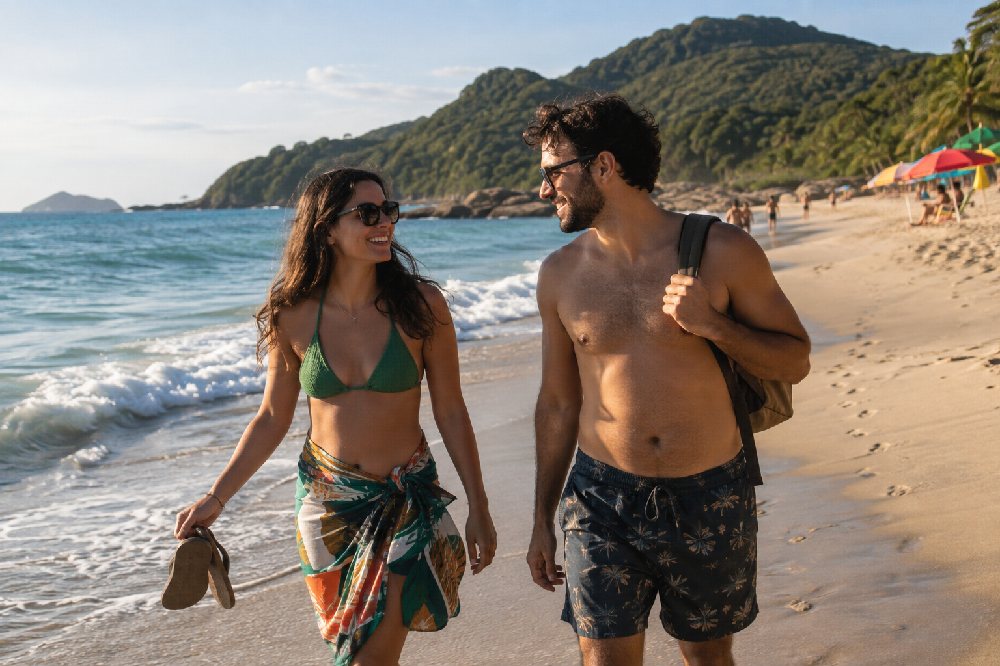
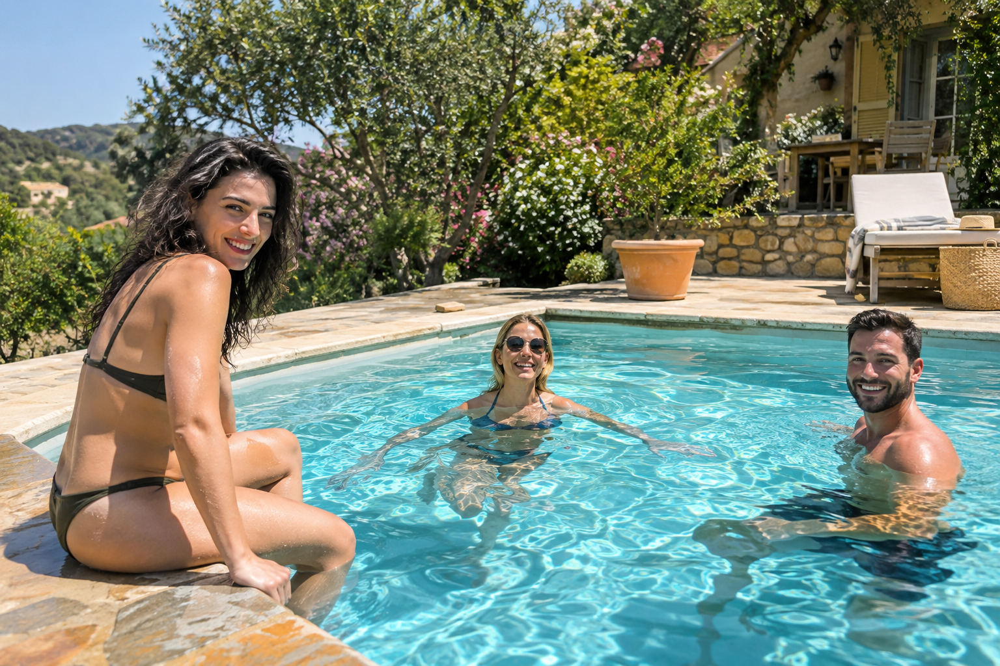
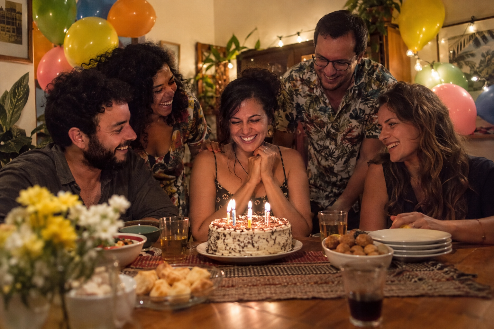
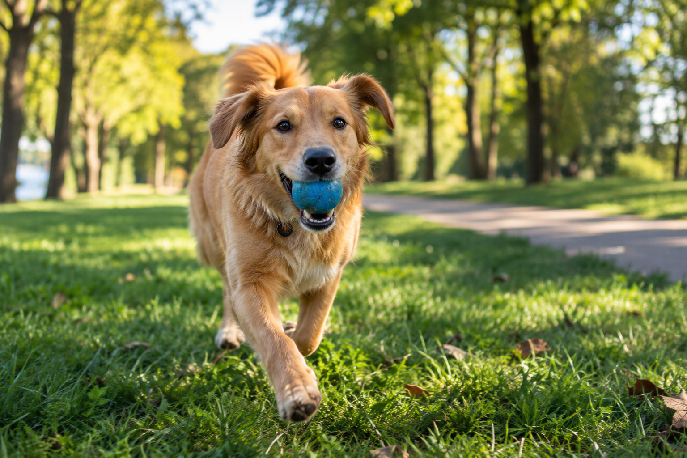

# Photo Wagon demo library

These are AI-generated photographs of fictional people, imported into the real
Photo Wagon app. Lucy, Alice, Joe, Nina, and Leo recur across beach, pool,
birthday, nightlife, vacation, and weekend photos.

## Run the app with the demo

After building the desktop app and installing the face models:

```sh
python3 tools/demo.py --open
```

This creates a new isolated library under `/tmp/photo-wagon-demo-*`, copies the
photos into dated folders, imports them through the core's IPC API, runs face
detection, and assigns names, albums, places, tags, and favorites through the
same APIs used by the UI. Your personal library and settings are untouched.
The printed `open-demo.sh` launcher reopens the prepared library.

The fixture uses YuNet, SFace (alignment), and ArcFace r100 from `models/`;
`--models DIR` selects another location. Tags, dates, locations, and names are
authored demonstration data from `library.json`, not claims about automatic
model accuracy. The app computes the actual thumbnails and face detections.

To reproduce the README captures, also build the desktop version of the phone
client (`cd mobile && dub build -c desktop --compiler=ldc2`), then run:

```sh
python3 tools/demo.py --capture docs/img
```

The tool writes `desktop.png`, `people.png`, `viewer.png`, and
`mobile-desktop.png` (the phone UI's desktop test build).
`--work /path/to/new-directory` chooses the demo data location; it must be new.

### Android screenshots in headless Waydroid

The README's Android screenshots come from the actual x86_64 APK running in
Waydroid on a separate headless Sway compositor. They include the Android system
bars and are saved directly by `adb exec-out screencap -p`, without compositing.
See the [Waydroid rig](../../ANDROID.md#the-waydroid-rig) for installation.

With Waydroid already running off-screen and connected to ADB:

```sh
ABI=x86_64 mobile/build-android.sh link
ABI=x86_64 mobile/build-android.sh package
python3 tools/demo_android.py --serial 192.168.240.112:5555 \
  --work /tmp/photo-wagon-demo-app --output docs/img \
  --apk mobile/build-android/x86_64/photo-wagon-mobile-debug.apk
```

Use the demo directory printed by `tools/demo.py` and your Waydroid ADB address.
The script requires a Waydroid device, copies only the generated source photos
to `Pictures/PhotoWagonDemoAI`, and selects that folder through Qt's debug launch
environment. It uses the existing debug APK and its settings; it does not clear
app data or remove other camera-roll files. It temporarily selects 1080×2400 at
420 dpi, connects to the isolated demo core through `adb reverse`, and captures
the timeline, people, and viewer. It then closes the app and its owned
core, removes that ADB tunnel, and restores the previous resolution and density.

Generation used the built-in `image_gen` tool. The individual source images are
kept unchanged; the app works on copies because tag writeback modifies metadata.
The original group scenes have additional unnamed fictional friends.

## Scenes

| Beach | Pool |
| --- | --- |
|  |  |
| Birthday party | Dog in the park |
|  |  |

## People

| Lucy | Alice | Joe | Nina | Leo |
| --- | --- | --- | --- | --- |
|  |  |  |  |  |

## Generation prompts

See [scene-prompts.md](scene-prompts.md) for the additional scenes with recurring
people and the Nina/Leo portraits. The original seven prompts follow.

### praia

Use case: photorealistic-natural. Asset type: one standalone sample photograph for the Photo Wagon photo-library demo. Create a believable candid holiday photo on a Brazilian beach: two adult friends walking near the surf, a few colorful umbrellas further along the sand, green coastal hills, blue-green ocean. Landscape 3:2 composition, handheld consumer camera feeling, warm late-afternoon natural sunlight, realistic skin and sand texture, relaxed everyday moment, tasteful natural colors. All people fictional. One continuous photograph filling the frame, no collage, no interface, no text, no watermark.

### piscina

Use case: photorealistic-natural. Asset type: one standalone sample photograph for the Photo Wagon photo-library demo. Create a believable candid summer pool photograph: three adult friends enjoying a small outdoor swimming pool at a holiday house, one seated casually at the pool edge, the others in the water, leafy garden and tiled terrace behind them. Landscape 3:2 composition, natural midday sunlight, turquoise water with realistic ripples and reflected light, informal family-album camera style, happy relaxed expressions, modest ordinary swimwear. All people fictional. One continuous photograph filling the frame, no collage, no interface, no text, no watermark.

### festa

Use case: photorealistic-natural. Asset type: one standalone sample photograph for the Photo Wagon photo-library demo. Create a believable candid photograph of a small birthday party at home in Brazil: a group of five adult friends gathered around a simple birthday cake with lit candles, laughing, colorful balloons and soft string lights in a cozy dining room, a few homemade snacks on the table. Landscape 3:2 composition, natural imperfect consumer-camera framing, warm evening light and a little realistic photographic grain, sincere everyday happiness rather than a posed advertisement. All people fictional. One continuous photograph filling the frame, no collage, no interface, no readable text, no watermark.

### cachorro

Use case: photorealistic-natural. Asset type: one standalone sample photograph for the Photo Wagon photo-library demo. Create a believable candid photo of a playful caramel-colored mixed-breed dog running through a green park carrying a small blue ball, ears bouncing, a tree-lined path softly out of focus behind it. Landscape 3:2 composition taken at the dog's eye level with a consumer camera, early-morning natural sunlight, realistic fur and slight motion in the paws, affectionate everyday pet photograph, natural colors. One continuous photograph filling the frame, no collage, no interface, no text, no watermark.

### lucy

Use case: photorealistic-natural. Asset type: standalone portrait photo of a fictional person named Lucy for a photo-manager demonstration library and face-recognition examples. Natural candid head-and-shoulders portrait of a smiling adult woman around 30, fair skin with gentle freckles, shoulder-length wavy auburn hair, brown eyes, wearing a simple forest-green shirt, outdoors with leafy garden softly blurred. Face unobstructed, looking near the camera, anatomically natural features and realistic skin texture, soft open-shade daylight, consumer family-album photograph rather than a fashion campaign. Portrait 2:3 composition. Fictional person, no resemblance to a celebrity requested. Single photograph, no labels, no text, no watermark, no collage.

### alice

Use case: photorealistic-natural. Asset type: standalone portrait photo of a fictional person named Alice for a photo-manager demonstration library and face-recognition examples. Natural candid head-and-shoulders portrait of a smiling adult Black woman around 30, rich brown skin, shoulder-length natural curly black hair, dark brown eyes, wearing a simple terracotta shirt, outdoors near a sunlit park with soft green background. Face unobstructed, looking near the camera, anatomically natural features and realistic skin texture, gentle late-afternoon daylight, consumer family-album photograph rather than a fashion campaign. Portrait 2:3 composition. Fictional person, no resemblance to a celebrity requested. Single photograph, no labels, no text, no watermark, no collage.

### joe

Use case: photorealistic-natural. Asset type: standalone portrait photo of a fictional person named Joe for a photo-manager demonstration library and face-recognition examples. Natural candid head-and-shoulders portrait of a smiling adult man around 35, medium olive skin, short dark brown hair and a neatly trimmed short beard, dark brown eyes, wearing a simple blue cotton shirt, outdoors on a shaded terrace with a softly blurred warm garden background. Face unobstructed, looking near the camera, anatomically natural features and realistic skin texture, soft natural daylight, consumer family-album photograph rather than a fashion campaign. Portrait 2:3 composition. Fictional person, no resemblance to a celebrity requested. Single photograph, no labels, no text, no watermark, no collage.
